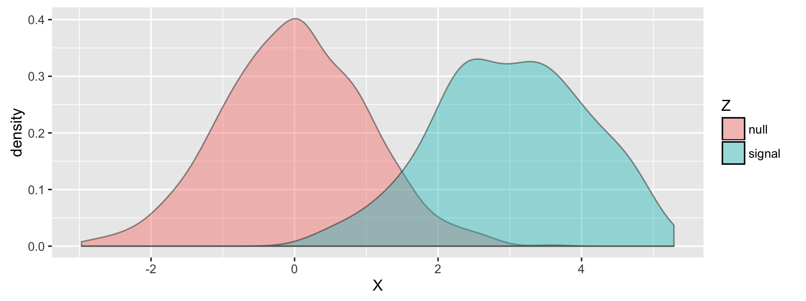

## Introduction 

There are many contexts and applications where data is observed sequentially through time. For instance in high freqeuncy stock trading, investment firms have to make rapid descions in repsonse to new stock evaluations on micro-second timescales, or in A/B testing, techology companies often test the effect of varied advertisements on the "click behavior" of a user which is correlated with the effectiveness of the advertisement [CITE, CITE]. The setting in which hypotehsis testing must be performed on sequential streaming data is called "online testing". In online testing controlling the False Discovery Rate (FDR) at a given level has unique challenges as one doesn't observe all the data that could potentially be seen, later in the time series. Here we propose to use and implement a Bayesian model-based appraoch to control FDR in the online testing setting. We review and contrast our approach to previous commonly used heuristics / algorithims that are effectetive but conservative in online hyptohesis testing. We show our approach has higher power when compared to previous methods. Finally, we discuss future extensions and applications of our method.

## Background

Broadly speaking, previous methods for controlling FDR in the online testing context use heuristics that increase or decrease the level at which one rejects a test depending on the number of previous discoveries made. Here we review three related, commonly used and well studied approaches to FDR control: $\alpha$ - investing, Levels Based on Number of Discoveries (LBOND), Levels Based on Recent Discoveries (LBORD) [CITE, CITE, CITE].

### $\alpha$-investing

Let:

$t$ - be time   
$w(t)$ - be a wealth function which changes through time    
$P_t$ - be a p-value output from an arbitrary test a time $t$  
$\alpha$ - a global level that one would like to control FDR at  
$\alpha_t$ - a time specific level  

In alpha-investing ones defines a wealth function $w$. We imagine p-values are streaming in over time $t$ which are provided by some abitrary test. We then proceed to run the $\alpha$-investing procedure:

1. $w(t=0) = \alpha$  
2. At time $t$ choose $\alpha_t \leq \frac{w(t-1)}{1 + w(t - 1)}$  
3. Rejct the null hypothesis if $P_t \leq \alpha_t$
3. Define $w(t)$ as a function of $w(t-1)$  
$$
w(t) = 
\begin{cases} 
      w(t-1) + \alpha & P_t \leq \alpha_t \\
      w(t-1) - \frac{\alpha_t}{1 - \alpha_t} & P_t > \alpha_t
\end{cases}
$$
4. Repeat the procedure starting back at (2) for each new data point in the time series.

As we can see above when we reject the null, the wealth function grows and when we fail to reject the null the wealth function decays. Specifically at time 0 we set the wealth function to a "global level" alpha. We then proceed to set a time specific $\alpha_t$. We then reject or fail to reject the p-value $P_t$ from time $t$ and redefine our wealth function $w$ depeding on what desicion was made. This ensures that the more discoveries we make the less stringent we are through time and reciprically the fewer discoveries we make the more stingent we are through time. For instance if we fail to reject for many sequential time points the signals have to be very strong to overcome the current state of the wealth function.

### LBOND / LBORD

Let:

$t$ - be time  
$P_t$ - be a p-value output from an arbitrary test a time $t$  
$\alpha$ - a global level that one would like to control FDR at   
$\beta_t$ - a time specific weight  
$D_t$ - count of discoveries made up to time $t$  

In Levels Based on Number of Discoveries (LBOND) we define a series of weights $\beta_t$ which all sum up to the global level $\alpha$. We then set a time specific $\alpha_t$ equal to the the weight at time $t$ times the max of 1 and the number of discoveries made up to the last time step $D_{t-1}$. We reject a p-value $P_t$ if its less that $\alpha_t$ and add to our discovery count. 

1. At time $t$ set $\alpha_t = \beta_t \cdot max\{1, D_{t - 1}\}$ where $\sum^\infty_{t=1} \beta_t = \alpha$
2. Reject if $P_t \leq \alpha_t$
3. If discovery add to $D$
4. Repeat

Levels Based on Recent Discoveries follows a similar appraoch but uses weights from the time when the last discovery was made.  

TODO: Fill Description of LBORD

## Methods 

Here we propose to apply a Bayesian approach to FDR control to the online testing setting. Specifically we follow the work of Efron and model our streaming data as test statistics coming from a mixture model [CITE]. A Bayesian approach to FDR control considers an underlying mixture distribution consisting of *null* and *signal* components, and controls FDR based on the parameters of this distribution:

***Figure 1**: Mixture densitiy yadadada*

Let:

$X$ - be a test statistic  
$\pi_0$ - be the proportion of nulls  
$\mu_1$ - be the mean of the signals  
$\sigma^2_1$ - be the variance of the signals  

$X$ can be modeled as a mixture of Gaussians:

$$X \mid \pi_0, \mu_1, \sigma^2_1 \sim \pi_0 N(0,1) + (1 - \pi_0) N(\mu_1, \sigma^2_1)$$

In *Figure 1* we can see a plot the resulting density of a simulated mixture model with the underlying parameters $\theta = \{\mu_0 = , \sigma^2_0 = 1, \pi_0 = .8, \mu_1 = 3, \sigma^2_1 = 1 \}$. We can see that assuming the data comes from an underlying mixture model with diverged means between the signal and null components can provide valuable information and flexibile approaches to controlling FDR. Paticularly if we assume that we only know the parameters of the null component, but we have to estimate $\pi_0, \mu_1, \sigma^2_1$ then we can control FDR at level:

$$\alpha = \frac{\pi_0(1 - \Phi(\hat{x}))}{\pi_0(1 - \Phi(\hat{x})) + (1-\pi_0)\left(1 - \Phi\left(\frac{\hat{x} -\mu_1}{\sigma_1}\right)\right)}$$

Where we reject $X$ if $X > \hat{x}$. We apply this mixture model framework to online testing by estimating the unknown parameters of the gaussian mixture model described above at each time point $t$. Specifically we use a Markov Chain Monte Carlo approach to sample from the posterior distributions of the unknown parameters $\theta = \{\pi_0, \mu_1, \sigma^2_1\}$. 

Let:  

$t$ - time index of a test statistic streaming in  
$X$ - a vector of $t$ test statistics that have streamed in  
$X_t$ - the test statistic at the $t^{th}$ time point  
$Z$ - vector of latent states of $X_t$ being a signal or null  
$Z_t$ - latent state at time $t$ of $X_t$ being a signal or null  
$\pi_0$ - proportion of nulls  
$\mu_1$ - mean of the signals  
$\sigma^2_1$ - variance of the signals  

As described above we model $X_t$ as a mixture of Gaussians:

$$X_t \mid \pi_0, \mu_1, \sigma^2_1 \sim \pi_0 N(0,1) + (1 - \pi_0) N(\mu_1, \sigma^2_1)$$
$$X_t \mid Z_t = 0 \sim N(0, 1)$$
$$X_t \mid Z_t = 1, \mu_1, \sigma^2_1 \sim N(\mu_1, \sigma^2_1)$$

We can reparameterize this model in terms of the precision $\phi_1$ of the signals and write down the likelihood of the model conditioned on the latent indicators as:

$$L(\pi_0, \mu_1, \sigma^2_1 \mid X, Z) \propto (\pi_0)^{n_0} exp(-\frac{1}{2} \sum_{t:z_t = 0} x_t^2) \cdot (1 - \pi_0)^{n_1} exp(-\frac{\phi_1}{2} \sum_{t:z_t = 1} (x_t - \mu_1)^2)$$

where $n_0$ and $n_1$ are the number of observed nulls and signals respectively. We can then set priors on $\pi_0, \mu_1, \phi_1$ which satisfy conjugacy:

$$\pi_0 \sim Beta(\alpha, \beta)$$
$$\phi_1 \sim Gamma(\frac{a}{2}, \frac{b}{2})$$
$$\mu_1 \mid \phi_1 \sim Normal(\mu^{*}, \frac{1}{\alpha^{*} \phi_1})$$

thus the posterior distributions of these parameters can be written as:

$$\pi_0 \mid X, Z = 0 \sim Beta(\alpha + n_0, \beta + n_1)$$
$$\phi_1 \mid X, Z \sim Gamma(\frac{a + n_1}{2}, b + \sum_{t:z_t = 1} (x_t - \mu_1)^2)$$
$$\mu_1 \mid X, Z, \phi_1 \sim Normal(\frac{\alpha^{*} \mu^{*} + n_1 + \bar{x_1}}{\alpha^{*} + n_1}, \frac{1}{(\alpha^{*} + n_1) \phi_1})$$

We also need to sample from the posterior of $Z$ due to the conditional dependencies above:

$$P(Z_t \mid X_t = x_t, \pi_0, \mu_1, \phi_1) = \frac{\pi_0 exp(-\frac{x^2_t}{2})}{\pi_0 exp(-\frac{x^2_t}{2}) + ((1 - \pi_0) \phi_1 exp(-\frac{\phi_1}{2} (x_t - \mu_1)^2))}$$

## Results

## Discussion 

## Conclusion

## References