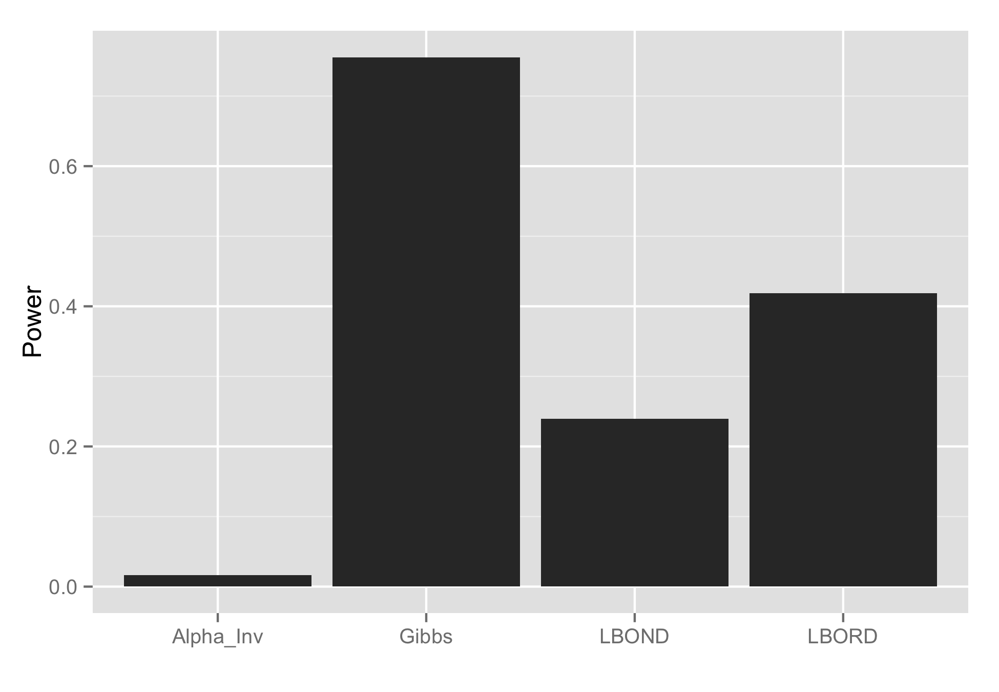

## Introduction 

There are many contexts where data is observed sequentially through time. For instance in high frequency stock trading, investment firms have to make rapid decisions in response to new stock evaluations within hundredths of a second, in A/B testing, technology companies often test the effect of varied advertisements on the "click behavior" of a user which is correlated with the effectiveness of the advertisement, or finally in genomics / or clinical trail applications streaming data can be common [@kohavi2009controlled, @javanmard2015online, @aharoni2014generalized]. The setting in which hypothesis testing must be performed on sequential-streaming data is called "online testing". 

In online testing controlling the False Discovery Rate (FDR) at a given level has unique challenges as one does not observe all the data beyond the current time point. Here we propose to use and implement a Bayesian model-based approach to control FDR in the online testing setting. We review and contrast our approach to previous commonly used heuristics / algorithms that are effective at controlling FDR but conservative (low power) in online hypothesis testing. We show our approach has higher power when compared to previous methods. Finally, we discuss future extensions, caveats, and applications of our method.

## Background

Broadly speaking, previous methods for controlling FDR in the online testing context use heuristics that increase or decrease the level at which one rejects a test depending on the number of previous discoveries made. Here we review three related approaches to FDR control: $\alpha$-investing, Levels Based on the Number of Discoveries (LBOND), Levels Based on Recent Discoveries (LBORD) [@foster2007alpha, @javanmard2015online].

### $\alpha$-investing

Let:

$t$ - be a time index  
$w(t)$ - be a wealth function which changes through time    
$P_t$ - be a p-value output from an arbitrary test at time $t$  
$\alpha$ - a global level for FDR control     
$\alpha_t$ - a time specific level for FDR control    

In $\alpha$-investing one defines a wealth function $w$. We imagine p-values are streaming to the researcher/statistician over time $t$ which are provided by some arbitrary test. We then proceed to run the $\alpha$-investing procedure:

1. Set $w(t=0) = \alpha$  
2. At time $t$ choose $\alpha_t \leq \frac{w(t-1)}{1 + w(t - 1)}$  
3. Reject the null hypothesis if $P_t \leq \alpha_t$
3. Define $w(t)$ as a function of $w(t-1)$  
$$
w(t) = 
\begin{cases} 
      w(t-1) + \alpha & P_t \leq \alpha_t \\
      w(t-1) - \frac{\alpha_t}{1 - \alpha_t} & P_t > \alpha_t
\end{cases}
$$
4. Repeat the procedure starting back at (2) for time $t+1$.


As we can see above when we reject the null, the wealth function grows and when we fail to reject the null the wealth function decays. Specifically at time 0 we set the wealth function to a "global level" $\alpha$. We then proceed to set a time specific $\alpha_t$. We then reject or fail to reject the p-value $P_t$ from time $t$ and redefine our wealth function $w$ depending on what decision was made. This ensures that the more discoveries we make the less stringent we are through time and reciprocally the fewer discoveries we make the more stringent we are through time. For instance, if we fail to reject the null hypothesis for a long stretch of time, a p-value must be exceptionally low to overcome the current state of the wealth function. 

### LBOND / LBORD

Let:

$t$ - be a time index  
$P_t$ - be a p-value output from an arbitrary test a time $t$  
$\alpha$ - a global level that one would like to control FDR at   
$\beta_t$ - a time specific weight  
$D_t$ - count of discoveries made up to time $t$  

In LBOND we define a series of weights $\beta_t$ which all sum up to the global level $\alpha$. We then set a time specific $\alpha_t$ equal to the weight at time $t$ multiplied by the max of 1 and the number of discoveries made up to the last time step $D_{t-1}$. We reject a p-value $P_t$ if it is less that $\alpha_t$ and add to our discovery count. 

1. At time $t$ set $\alpha_t = \beta_t \cdot max\{1, D_{t - 1}\}$ where $\sum^\infty_{t=1} \beta_t = \alpha$
2. Reject if $P_t \leq \alpha_t$
3. If $P_t \leq \alpha_t$ add to $D$
4. Repeat procedure starting at (1) for time $t+1$

Levels Based on Recent Discoveries follows a similar approach but uses weights from the time when the last discovery was made.  

1. At time $t$ set $\alpha_t = \beta_t \cdot max\{1, D_{t - \tau(t)}\}$ where $\sum^\infty_{t=1} \beta_t = \alpha$
2. Reject if $P_t \leq \alpha_t$
3. If discovery add to $D$
4. Repeat procedure starting at (1) for time $t+1$

Where $\tau(t)$ is the time of the most recent discovery before time $t$ and $\tau(t = 0) = 0$. LBORD has consistent power over time because the $\beta$ weight is reset after each discovery.

## Methods 

### Bayesian FDR

Here we propose to apply a Bayesian approach to FDR control in the online testing setting. Specifically we follow the work of Efron and model our streaming data as test statistics coming from a mixture model [@efron2002empirical]. A Bayesian approach to FDR control considers an underlying mixture distribution consisting of a *null* and *signal* components. The null component represents the distribution of the test statistic under the null hypothesis, and the signal component represents the distribution of the statistic under the alternate hypothesis. 

\begin{center}
  \begin{figure}[H]
  \includegraphics{../../presentation/img/mixture_density}
  \caption{Density of a mixture distribution of Gaussians simulated with 80\% proportion of nulls, the mean of the signal component at 3, variance of the signal component at 1, the mean of the null component at 0 and the variance of the null component at 1}
  \end{figure}
\end{center}

Let:

$X$ - be a test statistic  
$\pi_0$ - be the proportion of nulls  
$\mu_1$ - be the mean of the signal component  
$\sigma^2_1$ - be the variance of the signal component  

$X$ can be modeled as a mixture of Gaussians:

$$X \mid \pi_0, \mu_1, \sigma^2_1 \sim \pi_0 N(0,1) + (1 - \pi_0) N(\mu_1, \sigma^2_1)$$

In *Figure 1* we can see a plot the resulting density of a simulated mixture model with the underlying parameters $\theta = \{\mu_0 = , \sigma^2_0 = 1, \pi_0 = 0.8, \mu_1 = 3, \sigma^2_1 = 1 \}$. We can see that assuming the data comes from an underlying mixture model with diverged means between the signal and null components can inform flexible approaches to control FDR. Particularly, we assume that we only know the parameters of the null component. We can find the Bayesian interpretation of FDR:

$$
\begin{aligned}
\hat{FDR(x)} &= \mathbb{E}[\hat{FDP(x)}]\\
  &= \mathbb{E}\Bigg[\frac{P(X \in H_0, X > x)}{P(X > x)}\Bigg]\\
  &= \mathbb{E}\Bigg[\frac{\pi_0(1 - \Phi(x))}{(\pi_0 (1 - \Phi(x)) + (1 - \pi_0)(1 - \Phi(\frac{x - \mu_1}{\sigma_1}))}\Bigg] \\
  &= \frac{\pi_0(1 - \Phi(x))}{(\pi_0 (1 - \Phi(x)) + (1 - \pi_0)(1 - \Phi(\frac{x - \mu_1}{\sigma_1}))}
\end{aligned}
$$


We can see that if we know $\pi_0, \mu_1, \sigma^2_1$ then we can control FDR at a given level:

$$\alpha = \frac{\pi_0(1 - \Phi(\hat{x}))}{\pi_0(1 - \Phi(\hat{x})) + (1-\pi_0)\left(1 - \Phi\left(\frac{\hat{x} -\mu_1}{\sigma_1}\right)\right)}$$

Where we reject $X$ if $X > \hat{x}$. 

### Markov Chain Monte Carlo (Gibbs Sampler)

We apply this mixture model framework to online testing by estimating the unknown parameters of the Gaussian mixture model described above at each time point $t$. Specifically we use a Markov Chain Monte Carlo approach to sample from the posterior distributions of the unknown parameters $\theta = \{\pi_0, \mu_1, \sigma^2_1\}$. 

Let:  

$t$ - time index of a test statistic streaming in  
$X$ - a vector of $t$ test statistics that have streamed in  
$X_t$ - the test statistic at the $t^{th}$ time point  
$Z$ - vector of latent states of $X_t$ being a signal or null  
$Z_t$ - latent state at time $t$ of $X_t$ being a signal or null  
$\pi_0$ - proportion of nulls  
$\mu_1$ - mean of the signals  
$\sigma^2_1$ - variance of the signals  

As described above we model $X_t$ as a mixture of Gaussians:

$$X_t \mid \pi_0, \mu_1, \sigma^2_1 \sim \pi_0 N(0,1) + (1 - \pi_0) N(\mu_1, \sigma^2_1)$$
$$X_t \mid Z_t = 0 \sim N(0, 1)$$
$$X_t \mid Z_t = 1, \mu_1, \sigma^2_1 \sim N(\mu_1, \sigma^2_1)$$

We can reparameterize this model in terms of the precision $\phi_1$ of the signals and write down the likelihood of the model conditioned on the latent indicators as:

$$L(\pi_0, \mu_1, \sigma^2_1 \mid X, Z) \propto (\pi_0)^{n_0} exp(-\frac{1}{2} \sum_{t:z_t = 0} x_t^2) \cdot (1 - \pi_0)^{n_1} exp\left(-\frac{\phi_1}{2} \sum_{t:z_t = 1} (x_t - \mu_1)^2\right)$$

where $n_0$ and $n_1$ are the number of observed nulls and signals respectively. We can then set priors on $\pi_0, \mu_1, \phi_1$ which satisfy conjugacy:

$$\pi_0 \sim Beta(\alpha, \beta)$$
$$\phi_1 \sim Gamma(\frac{a}{2}, \frac{b}{2})$$
$$\mu_1 \mid \phi_1 \sim Normal(\mu^{*}, \frac{1}{\alpha^{*} \phi_1})$$

thus the posterior distributions of these parameters can be written as:

$$\pi_0 \mid X, Z = 0 \sim Beta(\alpha + n_0, \beta + n_1)$$
$$\phi_1 \mid X, Z \sim Gamma\left(\frac{a + n_1}{2}, b + \sum_{t:z_t = 1} (x_t - \mu_1)^2\right)$$
$$\mu_1 \mid X, Z, \phi_1 \sim Normal\left(\frac{\alpha^{*} \mu^{*} + n_1 + \bar{x}_1}{\alpha^{*} + n_1}, \frac{1}{(\alpha^{*} + n_1) \phi_1}\right)$$

We also need to sample from the posterior of $Z$ due to the conditional dependencies above:

$$P(Z_t \mid X_t = x_t, \pi_0, \mu_1, \phi_1) = \frac{\pi_0 exp(-\frac{x^2_t}{2})}{\pi_0 exp(-\frac{x^2_t}{2}) + ((1 - \pi_0) \phi_1 exp(-\frac{\phi_1}{2} (x_t - \mu_1)^2))}$$

We proceed to run the Gibbs sampling algorithm as follows:

1. Set $\pi^{(0)}_0$, $\mu^{(0)}_1$ and $\phi^{(0)}_1$  
2. Update $Z$ by sampling from its posterior conditioned on $X$ and the current values $\pi_0$, $\mu_1$, and $\phi_1$  
3. Update $\pi_0$ by sampling from its posterior conditioned on $X$  
4. Update $\phi_1$ by sampling from its posterior conditioned on $X$ and the current value of $Z$  
5. Update  $\mu_1$ by sampling from its posterior conditioned on $X$ and $\phi_1$
6. Repeat from (2) for $n$ iterations

## Results

### Simulation Study

We simulated independent and identically distributed data from a mixture model with the following parameters $\theta  = \{\pi_0 = 0.8, \mu_1 = 3, \sigma^2_1 = 1\}$ for 1000 time-steps. The resulting simulated values can be seen in *Figure 2*. 
\begin{figure}[H]
\includegraphics{../../presentation/img/simulation_points}
\caption{1000 Simulated Z-scores from a mixture distribution with $\theta  = \{\pi_0 = 0.80, \mu_1 = 3, \sigma^2_1 = 1\}$}
\end{figure}

From these simulated values we applied our Gibbs sampler to perform parameter estimations at each time point. The algorithm proceeds as follows:

1. At timestep $t$, use $X = (X_1, ... , X_t)$
2. Run 1000 iterations of the Gibbs Sampler using $X$
3. After a burn-in period of 50 iterations, we then choose one sample every 10 iterations.
4. Calculate the 95% credible interval from the posterior samples of the parameters
5. Repeat for the $t+1$ timestep

In *Figure 3*  we can see the 95% credible intervals of the parameters as a function of the time. Note that we *a priori* would expect the parameter estimation in the beginning to be poor due to a small amount of data used for the Gibbs sampling to estimate the posterior distribution. 

\begin{figure}[H]
\includegraphics{../../presentation/img/gibbs_results}
\caption{ Sequentially estimated credible intervals of the mixture model parameters under simulation conditions. Note that for $\sigma^2_1$ we truncated the $95^{th}$ quantile to 5 due to numerical precision.}
\end{figure}

### Estimating $\hat{x}$ Conservatively

Intuitively in the beginning of the time-series we have very little data to estimate our model, and thus our Bayesian FDR threshold may not be valid if we take a summary of our parameter estimates such as the mean. Thus we performed some numerical experiments in order to determine the appropriate bounds of $\theta = \{\pi_0, \mu_1, \sigma^2_1\}$. We simply varied one of the parameters while keeping the others fixed to the parameters in our simulation. The results of these simulations are shown in *Figure 4*

```{r, echo=FALSE, eval=FALSE}
library(dplyr)
library(gridExtra)
library(ggplot2)

pi0.sim <- 0.8
mu.sim <- 3
sigma2.sim <- 1
alpha <- 0.1

source("../../src/analysis/fdr_methods.R")

# Varying pi0
pi0.test <- seq(0.5, 0.99, by=0.01)
n <- length(pi0.test)
bayes.fdr.pi0 <- get_roots(BayesFDR, alpha=alpha, mus=rep(mu.sim, n), pi0s = pi0.test, sigma2s = rep(sigma2.sim,n))
p1 <- qplot(pi0.test, bayes.fdr.pi0, geom = "line") + theme_gray()


# Varying Mu
mu1.test <- seq(0.25, 5, by=0.01)
n <- length(mu1.test)
bayes.fdr.mu1 <- get_roots(BayesFDR, alpha=alpha, mus=mu1.test, pi0s = rep(pi0.sim,n), sigma2s = rep(sigma2.sim,n))
p2 <- qplot(mu1.test, bayes.fdr.mu1, geom = "line") + theme_gray()


# Varying Sigma2
sigma2.test <- seq(0.75, 5, by=0.01)
n <- length(sigma2.test)
bayes.fdr.sigma2 <- get_roots(BayesFDR, alpha=alpha, mus=rep(mu.sim, n), pi0s = rep(pi0.sim,n), sigma2s = sigma2.test )
p3 <- qplot(sigma2.test, bayes.fdr.sigma2, geom = "line") + theme_gray()


png("../../presentation/img/x_hat_experiments.png", width = 400, height = 300)
grid.arrange(p1, p2, p3, ncol=3)
dev.off()
```


**Figure 4** : The 

From the experiments above we have established that we are the most conservative when the following conditions hold: 

1. $\pi_0$ is high (closer to 1)
2. $\mu_1$ is low (closer to the null value)
3. $\sigma^2_1$ is high (the signal distribution is made more variable)

From these conclusions on the behavior of Bayesian FDR, we are able to get reasonably conservative bounds on the parameters that we desire. We take the lower bound of the 95% credible interval for $\mu_1$, and the upper bound of the 95% credible interval for $\pi_0$ and $\sigma^2_1$. The resulting values of $\hat{x}$ using these bounds are shown in *Figure 5*. It is promising to see that these estimates are higher than the value of $\hat{x}$ than if we knew the parameters of the mixture model *a priori*.  


**Figure 5**: * Plot of $\hat{x}$ with respect to time. We take the lower bound of the 95% credible interval for $\mu_1$ and the upper bound for both $\pi_0$ and $\sigma^2_1$. The dashed line represents the $\hat{x}$ value using the true parameters for the simulation. 

### Empircal Estimates of FDP and Power


**Figure 6**: *



**Figure 7**: *

## Conclusion

## References