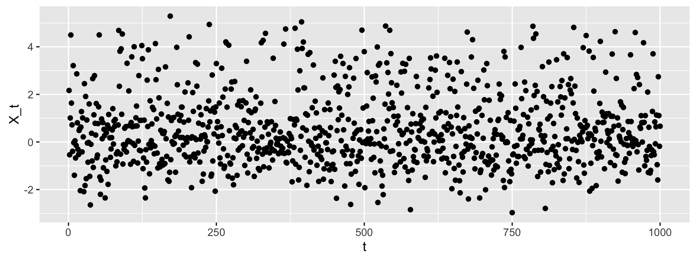

```{r setup, include=FALSE}
knitr::opts_chunk$set(echo = FALSE)
```

## Online Hypothesis Testing

Imagine that new data is presented to us sequentially over time. There are many scenarios where this might apply:  

- High frequency stock trading
- A/B testing for internet advertisements
- Sequential genetic / clinical studies

<center>

</center>

<aside class="notes">
<small>
So in the online testing context we imagine that data is revealed to us sequentially through time. In this setting we test hypothesis at each time point and control FDR at a given level without obersving all the data we could potentially see. Online testing is common in a wide range of scenarios including high frequency stock trading, A/B testing, and genetic / clincal applications that include streaming data. 
</small>
</aside>

## Methods for Online Testing

Previous methods for controlling FDR in online settings use heuristics that readily make decisions at each time point. Some of these methods include:

- Level Based on Number of Discoveries (LBOND)$^{1}$
- Level Based on *Recent* Discoveries (LBORD)$^{1}$
- $\alpha$-investing$^{2}$

<center>

</center>

<center>
*<small>
1) Javanmard and Montanari 2015  
2) Foster and Stine 2007
</small>*
</center>

<aside class="notes">
<small>
So lets quickly review a couple of methods that we also discussed in class designed for online hypothesis testing. Generally these methods use heuristics that increase or decrease the level at which we reject a test depending on the number of previous discoveries made. Some of these approaches include alpha-investing by Foster and Stine and LBOND and LBORD from Javanmard and Montanari.
</small>
</aside>

## Previous Methods 

<center>
*($\alpha$-investing)*
</center>

Define a wealth function $w(t)$. Rejections add to wealth and failing to reject takes away wealth:

1. $w(t=0) = \alpha$  
2. At time $t$ choose $\alpha_t \leq \frac{w(t-1)}{1 + w(t - 1)}$  
3. Define $w(t)$ as a function of $w(t-1)$  
$$
w(t) = 
\begin{cases} 
      w(t-1) + \alpha & P_t \leq \alpha_t \\
      w(t-1) - \frac{\alpha_t}{1 - \alpha_t} & P_t > \alpha_t
\end{cases}
$$

<aside class="notes">
<small>
In alpha-investing we define a wealth function w. When we reject the null, the wealth function grows and when we fail to reject the null the wealth function decays. Specifically at time 0 we set the wealth function to a "global level" alpha. For step 2 we then proceed to set a time specific alpha sub t. We then reject or fail to reject the P value from time t and redefine our wealth function depeding on what desicion we made. The general features of alpha-investing are 

* the more discoveries we make the less stringent we are through time
* the less discoveries we make the more stingent we are through time. 
* signals have to be very strong if one has failed to reject a lot.
</small>
</aside>

## Previous Methods 

<center>
*(LBOND/LBORD)*  
</center> 

1. At time $t$ set $\alpha_t = \beta_t \cdot max\{1, D_{t - 1}\}$ where $\sum^\infty_{t=1} \beta_t = \alpha$
2. Reject if $P_t \leq \alpha_t$
3. If discovery add to to $D$

*LBORD follows the same general idea, but we keep track of when the last discovery was made*

<aside class="notes">
<small>
In Levels Based on Number of Discoveries (LBOND) we define a series of weights beta sub t which all sum up to the global level alpha. We then set a time specific alpha equal to the the weight at time t times the max of 1 and the number of discoveries made up to the last time step. We call the discovery count D sub t minus 1. We reject a p value if its less that alpha sub t and add to our discovery count. Levels Based on Recent Discoveries follows a similar appraoch but uses weights from the time when the last discovery was made.  
</small>
</aside>

## Challenges in Online FDR Control

- Strict decision rules at each time point (can't update previous discoveries)
- Controlling Power and FDR simultaneously through a dynamic time-series is difficult
- Focus on limited features of the data (i.e. only number of discoveries)

<aside class="notes">
<small>
Some of the challenges in the outlined online testing appraoches include 

* that strict desicions rules have to be made at each time point and errors in previous desicions can propagate forward in time. For exampline in alpha-investing time-depedent correlation can reduce power.
* It is challenging to control both power and fdr when the time series data can be quite dynamic
* Finally heuristics don't allow for directly modeling uncertanity in the streaming data. We could imagine that accounting for some of this uncertainity could be helpful.
</small>
</aside>

## A Bayesian Approach to FDR

A Bayesian approach to FDR control considers an underlying mixture distribution consisting of *null* and *signal* components, and controls FDR based on the parameters of this distribution. 

```{r, fig.align='center', fig.height=3, echo=FALSE, eval=FALSE, warning=FALSE, message=FALSE}
library(ggplot2)
library(dplyr)
Mixture.List.Sim1 <- readRDS("../data/sim3_1000_08_3_1.rds")
X <- Mixture.List.Sim1$Z
Z <- Mixture.List.Sim1$true_signals
df <- data.frame(Z=Z, X=X) %>% mutate(Z = ifelse(Z == 1, "signal", "null"))

p <- ggplot(df, aes(X,fill=Z)) + geom_density(alpha=0.4) + ggsave("img/mixture_density.png")
```


<aside class="notes">
<small>
As we covered in class we take a Bayesian appraoch to FDR control in a general setting (not necessirly related to online testing). In this approach we model a given test statistic such as a Z score coming from a mixture model with a null and signal component. As we can see in the figure 

* the orange is the null component which is centered at a mean of zero
* the blueish color is the signal component which is centered at a mean of around three
</small>
</aside>

## Model Assumptions

- $X$ - a test statistic 
- $\pi_0$ - proportion of nulls
- $\mu_1$ - mean of the signals
- $\sigma^2_1$ - variance of the signals

$X$ can be modeled as a mixture of Gaussians:

$$X \mid \pi_0, \mu_1, \sigma^2_1 \sim \pi_0 N(0,1) + (1 - \pi_0) N(\mu_1, \sigma^2_1)$$

<aside class="notes">
<small>
To define notation we use for the rest of the talk:

Let X be a test statistic, pi0 be the true proportion of nulls in our data, mu_1 is the mean of the signal component and sigma^2_1 be the variance of the signal component. One common assumption is to model X as a mixture of gaussians with the defined parameters.
</small>
</aside>

## Controlling Bayesian FDR

If we assume that we only know the parameters of the null component, but we have to estimate $\pi_0, \mu_1, \sigma^2_1$ then we can control FDR at level:

$$\alpha = \frac{\pi_0(1 - \Phi(\hat{x}))}{\pi_0(1 - \Phi(\hat{x})) + (1-\pi_0)\left(1 - \Phi\left(\frac{\hat{x} -\mu_1}{\sigma_1}\right)\right)}$$

Where we reject $X$ if $X > \hat{x}$.

*How should we do the parameter estimation?* 

<center>

</center>

<aside class="notes">
<small>
Here we are assuming we know the parameters of the null component and have to estimate pi0, mu1, and sigma2_1. As we saw in our home work we can control for FDR at level alpha by finding the x_hat the satifies this equation and reject a test statistic if X > x_hat. One key problem we must ponder over (as seen in the pondering emoji) is how to esimate the unknown parameters.
</small>
</aside>

## Gibbs Sampler  
Let $Z$ be a latent indicator for being a signal ($Z=1$).

*Priors:*

$\pi_0 \sim Beta(\alpha, \beta)$  
$\phi_1 \sim Gamma\left(\frac{a}{2}, \frac{b}{2}\right)$  
$\mu_1 \mid \phi_1 \sim Normal\left(\mu^{*}, \frac{1}{\alpha^{*} \phi_1}\right)$  

*Posteriors:*

$\pi_0 \mid X, Z = 0 \sim Beta(\alpha + n_0, \beta + n_1)$  
$\phi_1 \mid X, Z \sim Gamma\left(\frac{a + n_1}{2}, b + \sum_{t:z_t = 1} (x_t - \mu_1)^2\right)$  
$\mu_1 \mid X, Z, \phi_1 \sim Normal\left(\frac{\alpha^{*} \mu^{*} + n_1 + \bar{x_1}}{\alpha^{*} + n_1}, \frac{1}{(\alpha^{*} + n_1) \phi_1}\right)$  
<aside class="notes">
<small>
We choose to use a gibbs sampler to estimate pi0, mu1, and sigma2_1. First we introduce a latent indicator variable Z that denotes the binary state of a test statistic being a signal or null. We then set priors such that we easily can write the posterior distribution of each parameter using conjugacy. Also note that we reparamterize the variance in terms of the presicion (1/variance) to make it easier to apply this conjugacy.
</small>
</aside>

## Online Bayesian FDR

Here we propose to:

- Estimate the parameters of the mixture model at a given time interval using the Gibbs sampler described previously
- Use the estimated mixture model to control the FDR

<i>
Our approach provides the ability to sample from the posterior of $Z$ when estimating the mixture model rather than fixing the number of discoveries as in LBOND and LBORD.
</i>

<aside class="notes">
 The assumption of LBOND and LBORD is that we have access only to what we called a discovery in the past, not the data itself. Here we have access to the data and are able to estimate model parameters using the data itself. We can't change our past decisions, but we can use the data to construct our model fit. 
</aside>


## Simulation Scenario

- We simulate 1000 time points, and a Z-score from each time point given $\theta = \{\pi = 0.8, \mu_1 = 3, \sigma^2_1 = 1\}$

```{r, fig.height=3, echo=FALSE, eval=FALSE, warning=FALSE, message=FALSE}
library(ggplot2)
Mixture.List.Sim1 <- readRDS("../data/sim3_1000_08_3_1.rds")
X <- Mixture.List.Sim1$Z

p <- qplot(seq_along(X), X, xlab="t",ylab="X_t") + ggsave("img/simulation_points.png")
```

<center>

</center>

<aside class="notes">
 The simulation example that we used here is similar in nature to the ones that were used in Rina's examples for the LBOND and LBORD (just now with more time points)
</aside>

## Gibbs Results 

```{r, echo=FALSE, warning=FALSE, eval=FALSE, message=FALSE}
library(ggplot2)
library(dplyr)
library(cowplot)

# Computing credible intervals of the different parameters
cred_intervals <- function(sum_stat_mat){
  n <- nrow(sum_stat_mat)
  cred.int <- matrix(NA, nrow=n, ncol=3)
  for (i in 1:n){
    cred.int[i, ] <- quantile(sum_stat_mat[i,], c(0.05,0.5,0.95))
    if (cred.int[i,1] < 0){cred.int[i,1] <- 0.0}
  }
  return(cred.int)
}

gibbs1000_samples <- readRDS("../data/sim3_1000_08_3_mcmc1.rds")
mu.credint2 <- cred_intervals(gibbs1000_samples$mu.samples)
df <- data.frame(fit=mu.credint2[,2], lwr=mu.credint2[,1], upr=mu.credint2[, 3])
df <- as.data.frame(df) %>% mutate(t = row_number())
p1 <- ggplot(df, aes(x = t, y = fit)) + geom_line() + geom_ribbon(aes(ymin=lwr, ymax=upr, alpha=.2, fill = "#fdae6b")) + ylim(0, 5) + ylab("mu1") + guides(fill=FALSE, alpha=FALSE) + theme_gray() + geom_hline(yintercept=3, linetype="dashed")

sigma2.credint <- cred_intervals(gibbs1000_samples$sigma2.samples)
df <- data.frame(fit=sigma2.credint[,2], lwr=sigma2.credint[,1], upr=sigma2.credint[, 3])
df <- as.data.frame(df) %>% mutate(t = row_number()) %>% rowwise() %>% mutate(upr = ifelse(upr > 5, 5, upr))
p2 <- ggplot(df, aes(x = t, y = fit)) + geom_line() + geom_ribbon(aes(ymin=lwr, ymax=upr, alpha=.2, fill = "#fdae6b")) + ylim(0, 5) + ylab("sigma2_1") + guides(fill=FALSE, alpha=FALSE) + theme_gray() + geom_hline(yintercept=1, linetype="dashed")

pi0.credint <- cred_intervals(gibbs1000_samples$pi0.samples)
df <- data.frame(fit=pi0.credint[,2], lwr=pi0.credint[,1], upr=pi0.credint[, 3])
df <- as.data.frame(df) %>% mutate(t = row_number())
p3 <- ggplot(df, aes(x = t, y = fit)) + geom_line() + geom_ribbon(aes(ymin=lwr, ymax=upr, alpha=.2, fill = "#fdae6b")) + ylim(0, 1.0) + ylab("pi0") + guides(fill=FALSE, alpha=FALSE) + theme_gray() + geom_hline(yintercept=.8, linetype="dashed")

p4 <- plot_grid(p3, p1, p2, nrow = 3) + ggsave("img/gibbs_results.png")
```

<center>

</center>

<aside class="notes">
  As expected, we can see that our parameter estimates in the beginning are really quite terrible. However, the credible intervals tighten up quite quickly (presumably due to the number of signals). This allows us to choose the parameters at each time-point that would provide the most conservative measurements of the critical threshold at which we would want to reject a particular z-score. Effectively we choose the 5th quantile of the mean, and the upper 95th quantile of both the proportion of nulls and the signal variance. 
</aside>

## Gibbs Results


<aside class="notes">
  What we show here is that our critical value is always above the value that we would have gotten if we had known the parameters of the mixture model at the beginning. It is more conservative at the beginning of the data stream, and closer to the optimal at the end. It is highly encouraging that we are conservative in the beginning since we do not have good estimates of the models yet. 
</aside>


## FDP


<aside class="notes">
  Here we compare the false-discovery proportion (FDP) empirically from our simulation. Alpha-investing and LBOND have zero false-discoveries in our simulation, whereas our method definitely has a couple of false-positives. However, we are still well-below the acceptable false-discovery proportion (with alpha = 0.1). 
</aside>

## Power


<aside class="notes">
  Here we can really see the benefit of our method in this setting. While we do not have as low of a False-discovery proportion as the other online methods, we certainly are able to have a much higher power. 
</aside>

## Caveats

- Really difficult to estimate model parameters with small amount of data
- Gibbs Sampling at each time point can be quite intensive (especially for later time points)
- High FDP compared to previous approaches

<aside class="notes">
  Another possibility is that the mean actually is not terribly different, but just that the signal variance is massive. We still have to think more carefully what we would like to do in this scenario.  
</aside>

## Further Directions

- More efficient inference procedure than MCMC
- Explore consequences of how frequently we re-estimate the model
- Correlation among the signals (i.e. simulate from a Markov Chain)
- Explore different modeling assumptions for signal and null distributions (i.e. multiple components in the mixture model)

<aside class="notes">
  Something that is critical here is that MCMC is really difficult to run at each iteration. It might be advantageous to use the MCMC estimates only after a certain point. Correlation in the underlying signal distribution can potentially bias the estimates that we get early on. 
</aside>

## Acknowledgements

- Rina Foygel Barber
- Yuancheng Zhu

<center>
**Thank you!**
</center>