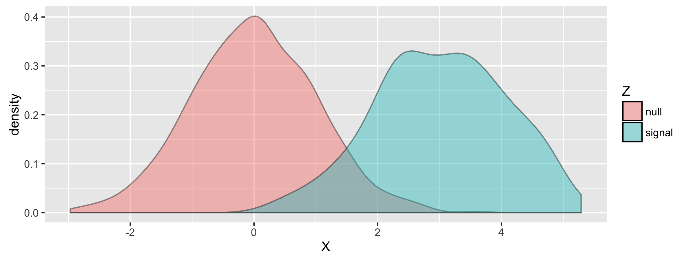

```{r setup, include=FALSE}
knitr::opts_chunk$set(echo = FALSE)
```

## Online Hypothesis Testing

Imagine that new data is presented to us sequentially over time. There are many scenarios where this might apply:  

- High frequency stock trading
- A/B testing for internet advertisements
- Sequential genetic / clinical studies

<center>

</center>

<aside class="notes">
  Oh hey, these are some notes. They'll be hidden in your presentation, but you can see them if you open the speaker notes window (hit 's' on your keyboard).
</aside>

## Methods for Online Testing

Previous methods for controlling FDR in online settings use heuristics that readily make decisions at each time point. Some of these methods include:

- Level Based on Number of Discoveries (LBOND)$^{1}$
- Level Based on *Recent* Discoveries (LBORD)$^{1}$
- $\alpha$-investing$^{2}$

<center>

</center>

<center>
*<small>
1) Javanmard and Montanari 2015  
2) Foster and Stine
</small>*
</center>

## Previous Methods 

<center>
*($\alpha$-investing)*
</center>

Define a wealth function $w(.)$. Rejections add to wealth and failing to reject takes away wealth:

1. $w(0) = \alpha$  
2. At time $t$ choose $\alpha_t \leq \frac{w(i-1)}{1 + w(i - 1)}$  
3. Define $w(t)$ as a function of $w(t-1)$  
$$
w(t) = 
\begin{cases} 
      w(t-1) + \alpha & P_t \leq \alpha_t \\
      w(t-1) - \frac{\alpha_t}{1 - \alpha_t} & P_t > \alpha_t
\end{cases}
$$

## Previous Methods 

<center>
*(LBOND/LBORD)*  
</center> 

1. At time $t$ set $\alpha_t = \beta_t \cdot max\{1, X_{i < t}\}$ where $\sum^\infty_{t=1} \beta_t = \alpha$
2. Reject if $P_t \leq \alpha_t$

*LBORD follows the same general idea, but we keep track of when the last discovery was made*

## Challenges in Online FDR Control

- Making a decision at each time-point (can't take them back)
- Difficult to estimate models early on in the data stream
- Controlling Power and FDR simulataneously through a dynamic time-series is difficult

## A Bayesian Approach to FDR

A Bayesian approach to FDR control considers an underlying mixture distribution consisting of *null* and *signal* components, and controls the FDR based on the parameters of this distribution. 

```{r, fig.align='center', fig.height=3, echo=FALSE, warning=FALSE, message=FALSE}
library(ggplot2)
library(dplyr)
Mixture.List.Sim1 <- readRDS("../data/sim1.rds")
X <- Mixture.List.Sim1$Z
Z <- Mixture.List.Sim1$true_signals
df <- data.frame(Z=Z, X=X) %>% mutate(Z = ifelse(Z == 1, "signal", "null"))

p <- ggplot(df, aes(X,fill=Z)) + geom_density(alpha=0.4) + ggsave("img/mixture_density.png")
```



## Model Assumptions

- $X$ - a test statistic 
- $\pi_0$ - proportion of nulls
- $\mu_1$ - mean of the signals
- $\sigma^2_1$ - variance of the signals

$X$ can be modelled as a mixture of Gaussians:

$$X \mid \pi_0, \mu_1, \sigma^2_1 \sim \pi_0 N(0,1) + (1 - \pi_0) N(\mu_1, \sigma^2_1)$$

## Controlling Bayesian FDR

If we assume that we only know the parameters of the null component, but we have to estimate $\pi_0, \mu_1, \sigma^2_1$ then we can control FDR:

$$\alpha = \frac{\pi_0(1 - \Phi(\hat{x}))}{\pi_0(1 - \Phi(\hat{x})) + (1-\pi_0)\left(1 - \Phi\left(\frac{\hat{x} -\mu_1}{\sigma_1}\right)\right)}$$

*Where we reject $X$ if $X > \hat{x}$.*

*How should we do the parameter estimation?* 

<center>

</center>

## Gibbs Sampler  
Let $Z$ be a latent indicator for being a signal ($Z=1$).

*Priors:*

$\pi_0 \sim Beta(\alpha, \beta)$  
$\phi_1 \sim Gamma\left(\frac{a}{2}, \frac{b}{2}\right)$  
$\mu_1 \mid \phi_1 \sim Normal\left(\mu^{*}, \frac{1}{\alpha^{*} \phi_1}\right)$  

*Posteriors:*

$\pi_0 \mid X, Z = 0 \sim Beta(\alpha + n_0, \beta + n_1)$  
$\phi_1 \mid X, Z \sim Gamma\left(\frac{a + n_1}{2}, b + \sum_{t:z_t = 1} (x_t - \mu_1)^2\right)$  
$\mu_1 \mid X, Z, \phi_1 \sim Normal\left(\frac{\alpha^{*} \mu^{*} + n_1 + \bar{x_1}}{\alpha^{*} + n_1}, \frac{1}{(\alpha^{*} + n_1) \phi_1}\right)$  

<!-- $$P(Z_t \mid X_t = x_t, \pi_0, \mu_1, \phi_1) = \frac{\pi_0 exp(-\frac{x^2_t}{2})}{\pi_0 exp(-\frac{x^2_t}{2}) + ((1 - \pi_0) \phi_1 exp(-\frac{\phi_1}{2} (x_t - \mu_1)^2))}$$ -->

## Online Bayesian FDR

Here we propose to:

- Estimate the parameters of the mixture model at a given time interval using the Gibbs sampler described above
- Use the estimated mixture model to control the FDR

<i>
Our approach provides the ability to sample from the posterior of $Z$ when esimtating the mixture model rather than fixing the number of discoveries as in LBOND and LBORD.
</i>

## Simulation Scenario

- We simulate 500 time points, and a Z-score from each time point given $\theta = \{\pi = 0.9, \mu_1 = 3, \sigma^2_1 = 1\}$

```{r, fig.height=3, echo=FALSE, warning=FALSE, message=FALSE}
library(ggplot2)
Mixture.List.Sim1 <- readRDS("../data/sim1.rds")
X <- Mixture.List.Sim1$Z

p <- qplot(seq_along(X),X, xlab="t",ylab="X_t") + ggsave("img/simulation_points.png")
```

<center>

</center>

## False-Positive Rates (Empirical)

## Power (Empirical)

## Caveats to Inference 

- Really difficult to estimate model parameters with small amount of data
- Iterative Gibbs Sampling can be quite intensive

## Further Directions

- More efficient inference procedure than MCMC
- Explore consequences of how frequently we re-estimate the model
- Correlation amongst the signals (i.e. simulate from a Markov Chain)
- Explore different modeling assumptions for signal and null distributions (i.e. multiple components in the mixture model)

## Acknowledgements

Thank you

- Rina Barber
- Yuancheng Zhu